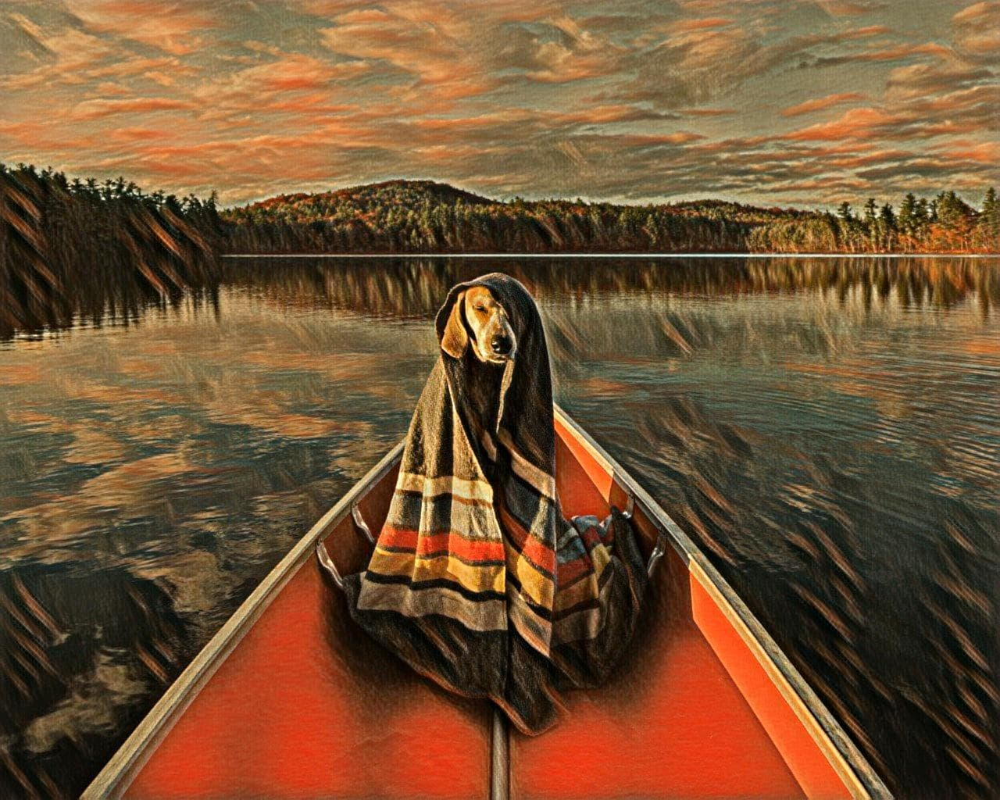
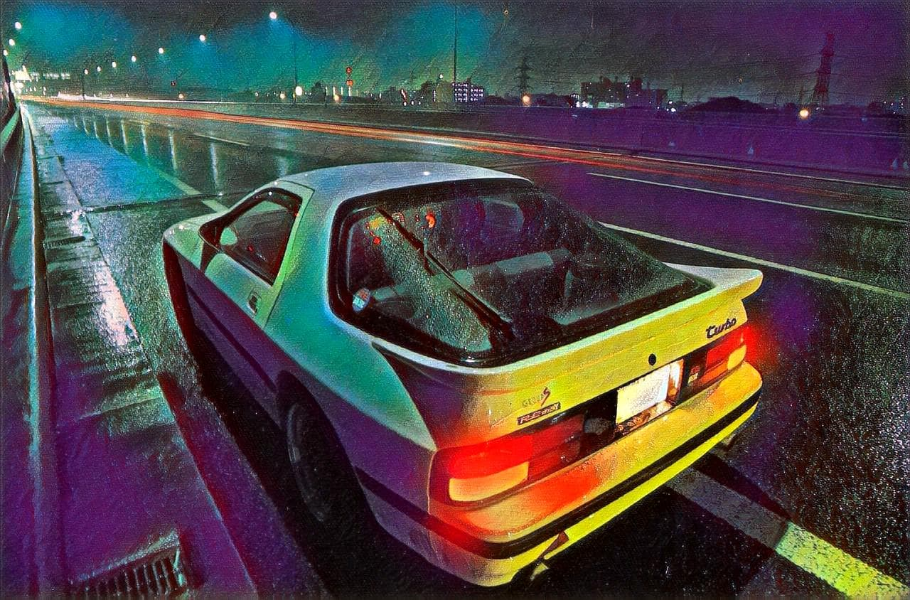
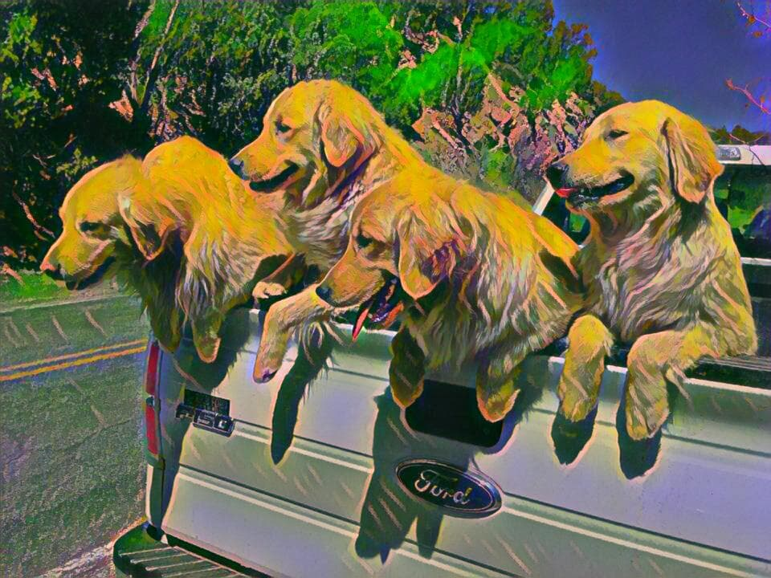
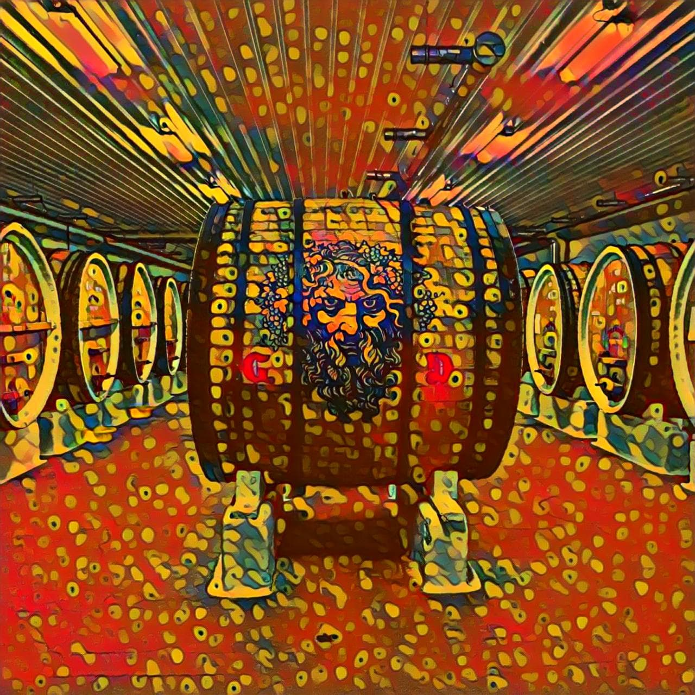
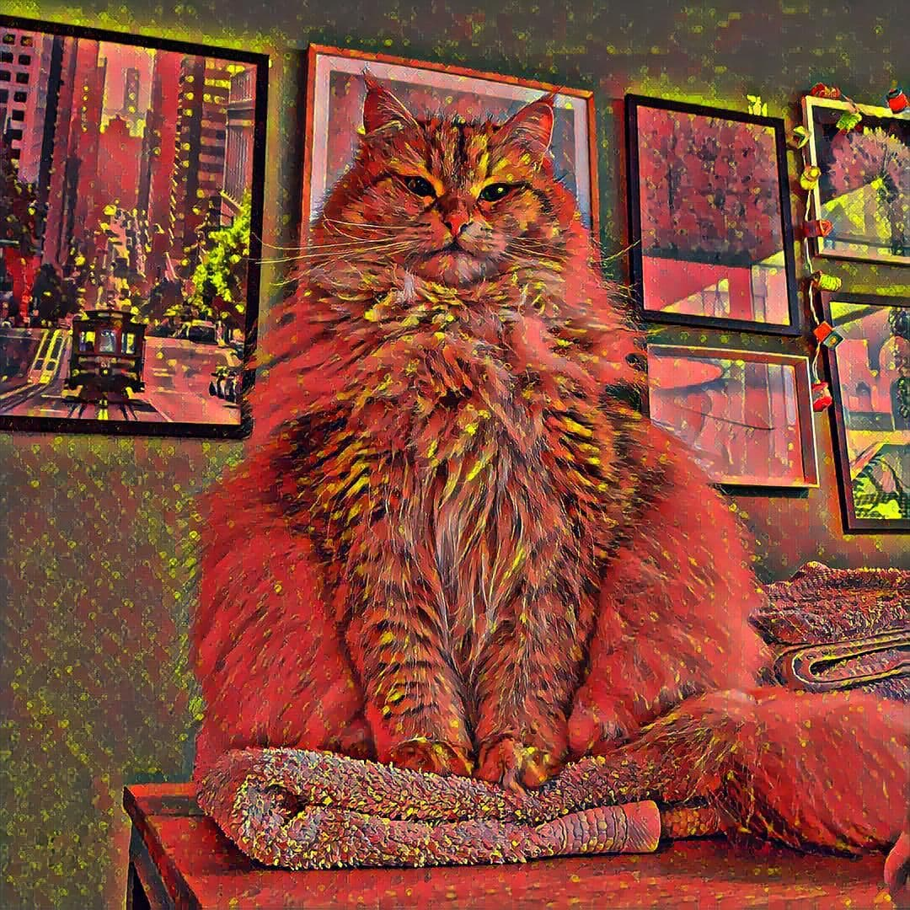
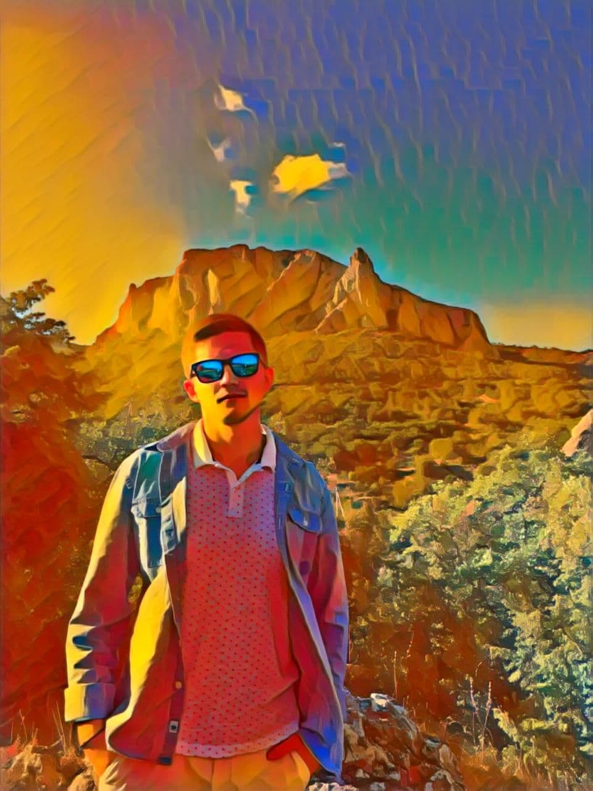

# Neural-style-transfer Telegram bot 🎨🤖

Telegram бот для стилизации фотографий.
В качестве алгоритма стилизации, используется алгоритм быстрого переноса стиля, описанный в статьях
[Perceptual Loss`es for Real-Time Style Transfer and Super-Resolution](https://arxiv.org/pdf/1603.08155.pdf)
и [Instance Normalization](https://arxiv.org/pdf/1607.08022.pdf). 
Официальный репозиторий авторов статьи можно найти [тут](https://github.com/jcjohnson/fast-neural-style), 
pytorch версия представлена [здесь](https://github.com/pytorch/examples/blob/master/fast_neural_style).

# Style image 🎨

# Telegram API 🤖
Телеграм бот разработан на `aiogram` и имеет удобный интерфейс. 
Все управление происходит через встроенную клавиатуру, но всегда можно ввести команду `/help` или
`/start`
для вывода начального сообщения.

Для стилизации фотографии необходимо:
1. Нажать кнопку `Загрузить фотографию` и загрузить ее;
2. Нажать кнопку `Стилизовать`, и из предложенных вариантов указать номер стиля;
3. Ожидать какое-то время, после чего бот пришлет вам в ответ уже стилизованное фото;

Также, при нажатии на кнопку `Показать примеры` бот покажет несколько превьюшек стилизованных фотографий.

# Deploy 🚀
Проект развернут и функционирует на сервисе `Heroku`, приложение можно найти по 
[ссылке](https://nst-telegram-bot.herokuapp.com/), или напрямую в Telegram `@DLSstyletransfer_001_bot`.